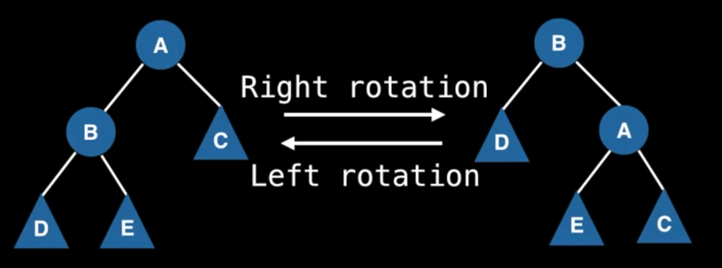

## [YouTube - Data Structures Easy to Advanced Course - Full Tutorial from a Google Engineer](https://www.youtube.com/watch?v=RBSGKlAvoiM&t=24493s)
a balanced binary search tree (bbst) is a self-balancing binary search tree - it adjusts itself in order to maintain a logarithmic height, which allows for faster operations.

### complexity
|operation|average|worst|
|insert|logarithmic|logarithmic|
|delete|logarithmic|logarithmic|
|remove|logarithmic|logarithmic|
|search|logarithmic|logarithmic|

### tree rotations

rotations are fine since they don't break the BST invariant.

right rotation: A becomes the **right child** of B
left rotation: B becomes the **left child** of A

```
function rotateRight(A):
  B := A.left
  A.left = B.right
  B.right = A
  return B

  note: the parent A needs to be updated to become the parent of B, since A is now the child of B
```
reason about it this way - on a right rotation, node A becomes the right child of B. this means we need to find a new spot for B's previous right child, E. since we know E is less than A (was in the left subtree of A), it must remain in the left subtree of A.

### avl tree
the property which keeps an avl tree balanced is called the balanced factor (bf)
`bf(node) = H(node.right) - H(node.left) where H(x) is the height of node x`
remember: height of a node is the number of **edges** between the node and the furthest leaf. a single node has zero height.
note: a negative bf means the height of the left child is greater than the height of the right child, while a positive bf means the hight of the right child is greater than the height of the left child.

additional avl invariant: the balance factor of every node is either -1, 0, or 1

restoring the tree invariant:
note that an imbalance means either a +2 or a -2 bf. anything greater and it means the tree we started with was not an avl tree.
- left left case (bf of current node is negative, bf of left child is negative)
  `bf is -2, bf of left child is -1`
  algorithm: perform a right rotation
- left right case (bf of current node is negative, bf of left child is positive)
  `bf is -2, bf of left child is +1`
  algorithm: perform a left rotation then a right rotation
- right right case (bf of current node is positive, bf of right child is positive)
  `bf is +2, bf of left child is +1`
  algorithm: perform a left rotation
- right left case (bf of current node is positive, bf of right child is negative)
  `bf is +2, bf of left child is -1`
  algorithm: perform a right rotation then a left rotation

note: at the end of your avl tree insertion, you need to update the heights/bfs of each node!!

### removing elements from a bst
1. find the element we wish to remove (if it exists)
2. replace the node we want to remove with its successor (if any) to maintain the bst invariant
  a. if node is a leaf node, simply do nothing
  b. if node has either left or right children (but not both), the child becomes the successor
  c. if node has both left and right children, either the smallest value in the right subtree (go right once, then left as much as possible) or the biggest value in the left subtree (go left once, then right as much as possible) can be the successor. once the successor's value has been copied, be sure to remove the duplicate value from the tree!!

in the avl case, after performing the removal algorithm above, simply update the bf values and balance the tree if needed.
