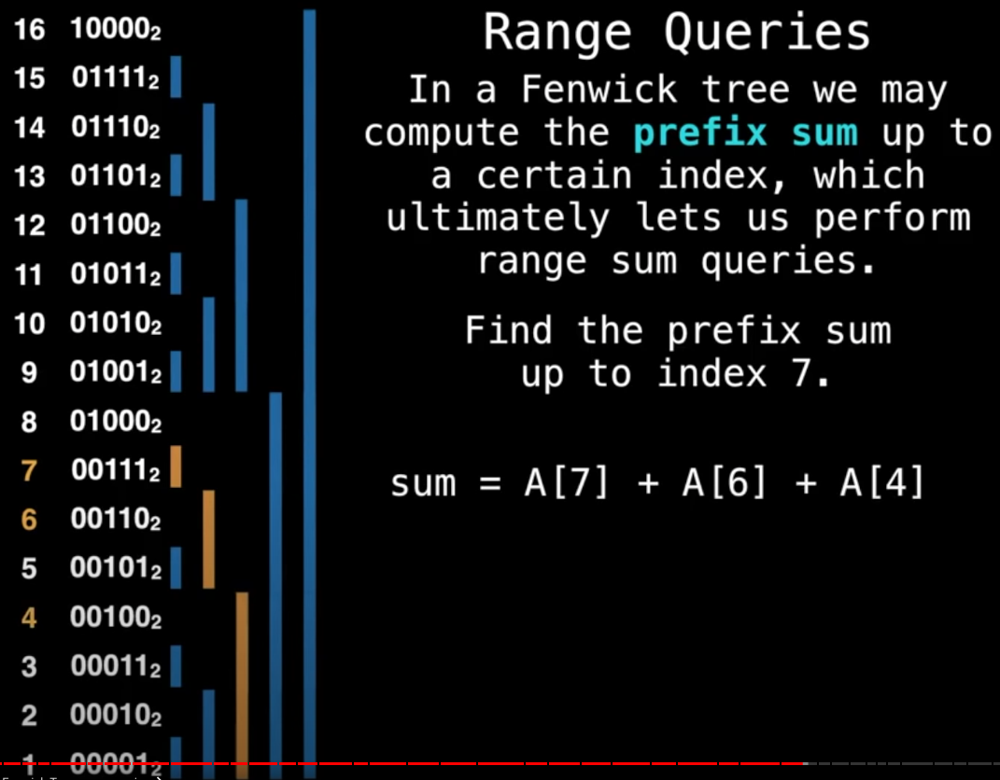

## [YouTube - Data Structures Easy to Advanced Course - Full Tutorial from a Google Engineer](https://youtu.be/RBSGKlAvoiM?t=20737)
note: given an array of integers, a range sum is the sum of any given range [i, j) for than array.

### example
we are given `A = [5, -3, 6, 1, 0, -4, 11, 6, 2, 7]` where we want to find the range sum for arbitrary ranges.
we can create a prefix sum array, P, which holds the range sum for [0, i) where i is the index in that array. note that P[0] will always be 0.
`P = [0, 5, 2, 8, 9, 9, 5, 16, 22, 24, 31]`
now, sum of A from [2, 7) = P[7] - P[2]
note: now, if a A[4] changes (this is called a point update), we have to recompute all values in P[5, ..]. this takes linear time, which sucks. the fenwick tree data structure exists to improve on this.

### definition
a fenwick tree (aka binary indexed tree) is a data structure that supports efficiently finding range sums in a **static array**, and point updates in said array. a point update is when an item in the static array is updated.
alternatively put, a fenwick tree or binary indexed tree is a data structure that can efficiently update elements and calculate prefix sums in a table of numbers.

### complexity
| construction | linear |
| point update | logarithmic |
| range sum | logarithmic |
| range update | logarithmic |
| adding index | n/a |
| removing index | n/a |

### how it works
in a fenwick tree, a cell in the array is responsible for other cells, not just for "itself". the position of the least significant bit (lsb) determines the range of responsibility that cell has.

```
4 100₂
3 011₂
2 010₂
1 001₂

the above structure is a 1-based array, F, representing a fenwick tree. only the indexes of the array are shown - for now the values of each cell is irrelevant.
**Note: fenwick trees are 1-based**

F[2] has its lsb at position 2 and so is responsible for 2²⁻¹ cells (i.e. 2 cells)
F[3] has its lsb at position 1 and so is responsible for 2¹⁻¹ cells (i.e. 1 cells)
F[4] has its lsb at position 3 and so is responsible for 2³⁻¹ cells (i.e. 4 cells)
```


to find the prefix sum of [1, i], sum up the values at i, cascading downwards untill you reach zero. each time you cascade down, ignore the cells that the current index is responsible for.
**note: prefix sum for fenwick trees are inclusive**



### range queries
the range sum of [11, 15] = prefix sum of [1, 15] - prefix sum of \[1, 11)
note the nuances between inclusive and non-inclusive indexes

note that each time we cascade down, we "turn off" the bit we are currently on and cascade down to the index with the next bit "turned on".
```
for example, 111 -> 110 -> 100 -> 000.
another example, 1010 -> 1000 -> 0000.
one last example, 1111 -> 1110 -> 1100 -> 1000 -> 0000.

next index to add to sum = current index - number represented by lsb
```

this means the worst case for the fenwick tree is where the index queried has all its bits set to 1 (i.e. index = 2ⁿ⁻¹). in this worst case, we need log₂(n) operations to figure out the prefix sum.

### point updates
remember that point updates are the downfall of prefix sum arrays and the reason fenwick trees exist.
point updates are the opposite of range queries - we propagate up each time to figure out the next index to update, stopping when we get out of bounds of our array.

```
for example, 00110 -> 01000 -> 10000.
another example, 01001 -> 01010 -> 01100 -> 10000

next index to update = current index + number represented by lsb
```

### fenwick tree construction
naively, start with an empty fenwick tree and do a point update one by one. this yields a time complexity of O(n log(n)).
an optimization is to start with a fenwick tree representing our input values instead of an empty tree. then we go through our tree performing point updates to our parents, using our current value. this yields a linear construction time complexity.

### other resources
- https://medium.com/@iamworldian/binary-indexed-tree-fenwick-tree-36b71fb90f42

the idea behind the fenwick tree is that each cell stores a partial sum for a range of cells below it. from any given index, using bitwise operations, it's easy to figure out the next cell to go to in order to calculate the prefix sum of the input array at said index.
```
given n = 7,
prefix sum = partial[7] + partial[6] + partial[4]

given n = 15,
prefix sum = partial[15] + partial[14] + partial[12] + partial[8]
```
note that the fenwick tree has been constructed in such a way that summing up the partials results in the prefix sum.
