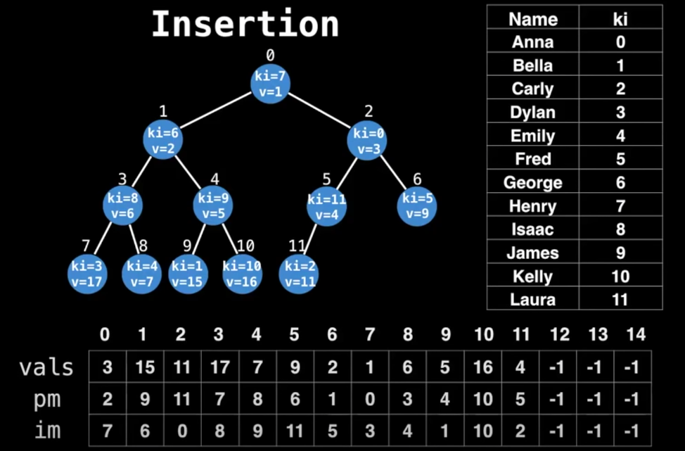

## [YouTube - Data Structures Easy to Advanced Course - Full Tutorial from a Google Engineer](https://www.youtube.com/watch?v=RBSGKlAvoiM&t=27049s)
an indexed priority queue is a priority queue variant which supports quick updates and deletions of key-value pairs
note: a priority queue supports values, not key-value pairs, and performs poorly (comparatively) on updates and deletions

### steps
we want to maintain an indexed priority queue for people. remember that priority queues are backed by an array.
1. assign each person a key index. this key is used to track the person within our array
2. track values based on the key index. these values can be tracked in an array.
  - vals: the priority value for a given index. e.g. if bella has a priority value of 15, she's the 15th next person to be served
  - pm: the position map for a given index. this enables us go from a person to a node in the heap. e.g. if bella has a pm of 9, she is the 9th node in the heap
  - im: the inverse map for a given index. this enables us to go from a node in the heap to the matching person. it's the inverse of pm
note: step 2 simply provides a way to be able to map between a person and their characteristics in the priority tree using their key index.

note: this datastructure is an **indexed** priority tree. the `vals`, `pm` and `im` arrays are used to track interesting information for each person, using the key index as the mapping between our person and their data.

### operations
some added complexity is introduced with each operation because you need to perform additional swaps in the tracking arrays.
time complexity is improved whenever you need to lookup a node because the node is indexed, but bubbling up/down still takes logarithmic time.
