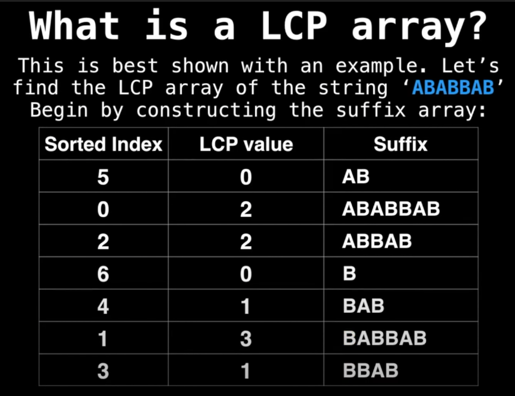
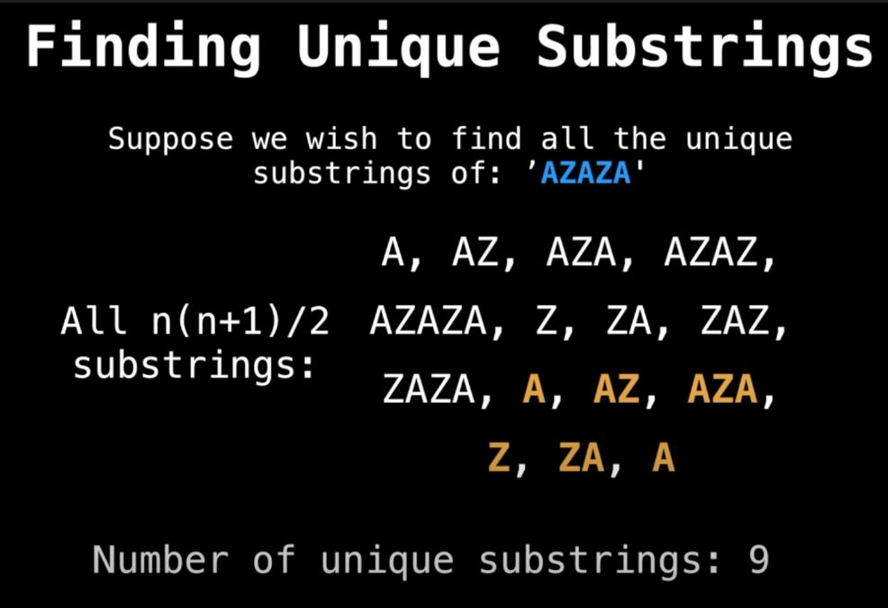
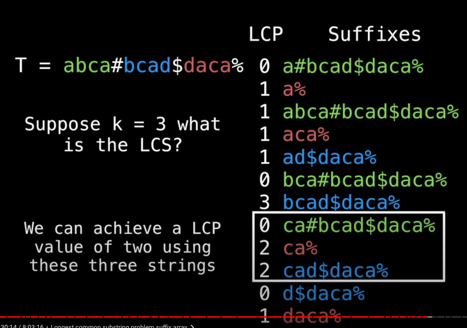

## [YouTube - Data Structures Easy to Advanced Course - Full Tutorial from a Google Engineer](https://www.youtube.com/watch?v=RBSGKlAvoiM&t=21794s)
a suffix array is an array which contains the sorted indices of all suffixes of a string. it was desigend to provide a space efficient alternative to a suffix tree (go figure out what a suffix tree is if you don't know).

### example
the sorted array of suffixes for camel is [amel, camel, el, l, mel].
the suffix array for camel is [1, 0, 3, 4, 2].

### longest common prefix (lcp) array
the lcp array is an array in which every index tracks how **many characters two sorted adjacent suffixes have in common**.

the lcp array above is [0, 2, 2, 0, 1, 3, 1]

### finding unique substrings
find the number of unique substrings of 'azaza'


```
number of unique substrings = number of substrings - number of duplicates
number of substrings = n(n+1)/2 (apparently this is easy to prove)
number of duplicates = sum of values in lcp array
```
what's important to note here is that each value in the lcp array essentially tracks the number of duplicates between two substrings

### longest common substring (lcs)
given n strings, find the longest common substring that appears in at least 2 <= k <= n of the strings
for example, consider `n = 3, k = 2, S₁ = 'abca', S₂ = 'bcad', S₃ = 'daca'`. the solution would be 'bca' since at least k = 2 string both share that substring and it's the longest.
this problem can be solved using the suffix array which can find the solution in O(n₁ + n₂ + ...)

solution:
1. combine S₁, S₂, S₃ into a single string T, separated by unique sentinels 
  `T = abca#bcad$daca%`
  the sentinel values must be unique and lexicographically less than any of the characters
2. create a sorted adjacent suffix array and lcp array for T
3. ignore any values in the sorted adjacent suffix array that start with our sentinel values since we injected those into the string
4. if k = 3, we select 3 entries from the suffixes array till we have three that are each from a different string. then use the corresponding indexes in the lcp array to figure out the lcs (i.e. the minimum value in the lcp array). note that we ignore the first entry - consider it index 0 in previous examples, which we always ignore since lcp arrays are one-based.
try to make sense of this img: 

[an example solution](https://www.youtube.com/watch?v=RBSGKlAvoiM&t=23824s)

### longest repeated substring (lrs)
find the lrs of the string `abracadabra` (i.e. the longest substring that repeats within the string). the solution is `abra`.
simply find the maximum value in the lcp array - that index and the previous index will be the lrs since that's the information encoded in the lcp.
