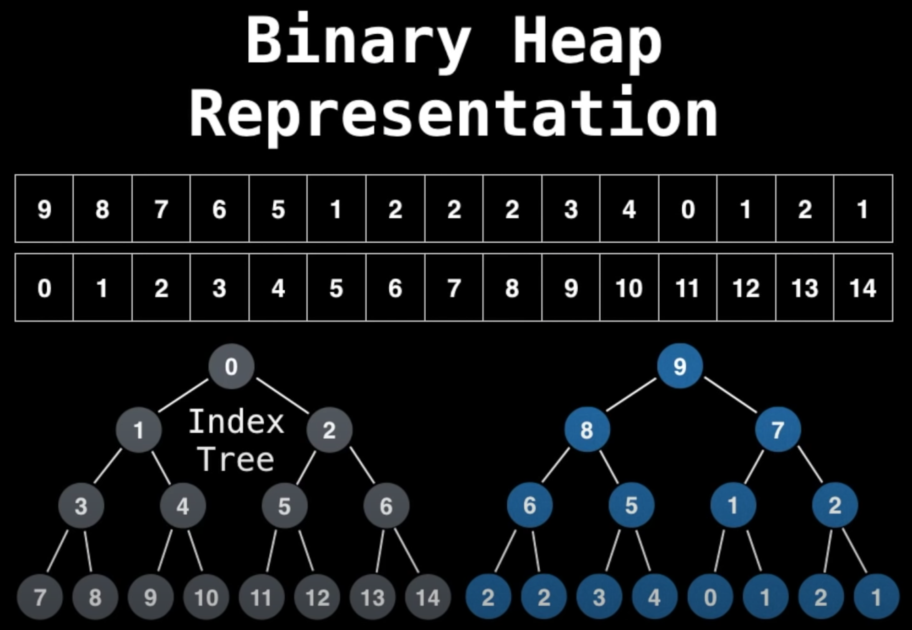

## [YouTube - Data Structures Easy to Advanced Course - Full Tutorial from a Google Engineer](https://youtu.be/RBSGKlAvoiM?t=5493)
A priority queue (PQ) is an Abstract Data Type that operates similar to a normal queue with the exception that each element has a certain priority.
With each dequeue operation, the element with the highest priority is dequeued first.
Note: the highest priority does not necessarily mean the highest number (e.g. a min PQ will dequeue the lowest number first)

### Heaps
Note: A PQ is most efficiently modeled with a heap, so much so that the terms are used interchangeably. Be aware though that a PQ is an abstract data type while a heap is **ONE** implementation of a PQ.

A heap is a tree based data structure that satisfies the *heap invariant*: If A is a parent node of B then A is ordered with respect to B for all nodes A, B in the heap.
Min-heap invariant: If A is a parent node of B then A is less than or equal to B for all nodes A, B in the heap.
Max-heap invariant: If A is a parent node of B then A is greater than or equal to B for all nodes A, B in the heap.

Note: a heap does not have to be a binary heap.

### Uses
- some implementations of Dijkstra's Shortest Path algorithm
- fetching the "next best" or "next worst" element
- BFS algorithms (e.g. A\*) use PQs to grab the next most promising node
- Minimum Spanning Tree (MST) algorithms

### Complexity Analysis
| Binary Heap construction | O(n) | there's an algorithm for this |
| Polling | O(log(n)) | you need to reorder the heap to satisfy the heap invariant |
| Peeking | O(1) |
| Adding | O(log(n)) | you need to reorder the heap to satisfy the heap invariant |
| Naive Removing | O(n) | naive because a hash table can be used to improve performance |
| Naive contains | O(n) | naive because a hash table can be used to improve performance |

### Turning Min PQ to Max PQ
Simply negate a min PQ to get a max PQ and vice versa

### Adding Elements to a Binary Heap
Note: a complete binary tree is a tree in which every level, except possibly the last, is completely filled. If the last level is not completely filled, the nodes are as far left as possible.

