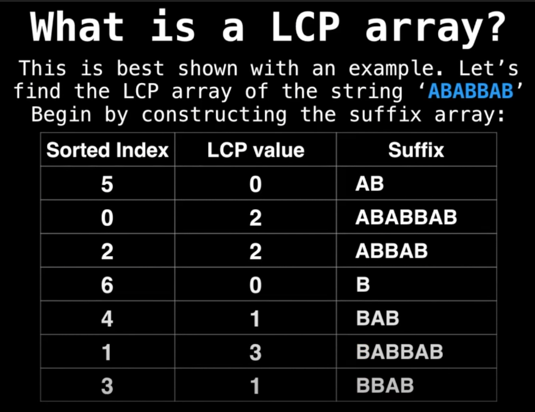
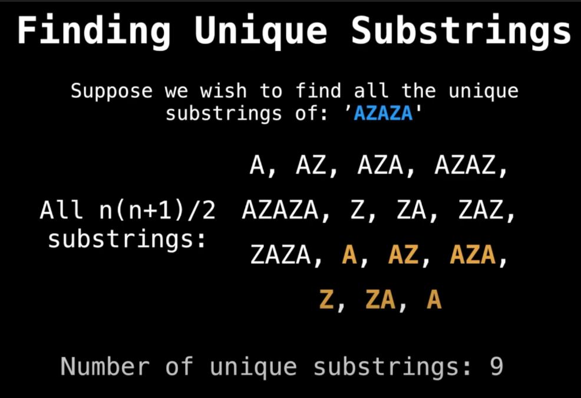

## [YouTube - Data Structures Easy to Advanced Course - Full Tutorial from a Google Engineer](https://www.youtube.com/watch?v=RBSGKlAvoiM&t=21794s)
a suffix array is an array which contains the sorted indices of all suffixes of a string. it was desigend to provide a space efficient alternative to a suffix tree (go figure out what a suffix tree is if you don't know).

### example
the sorted array of suffixes for camel is [amel, camel, el, l, mel].
the suffix array for camel is [1, 0, 3, 4, 2].

### longest common prefix (lcp) array
the lcp array is an array in which every index tracks how **many characters two sorted adjacent suffixes have in common**.

the lcp array above is [0, 2, 2, 0, 1, 3, 1]

### finding unique substrings
find the number of unique substrings of 'azaza'


```
number of unique substrings = number of substrings - number of duplicates
number of substrings = n(n+1)/2 (apparently this is easy to prove)
number of duplicates = sum of values in lcp array
```
what's important to note here is that each value in the lcp array essentially tracks the number of duplicates between two substrings

### longest common substring (lcs)
given n strings, find the longest common substring that appears in at least 2 <= k <= n of the strings
for example, consider `n = 3, k = 2, S₁ = 'abca', S₂ = 'bcad', S₃ = 'daca'`. the solution would be 'bca'.
