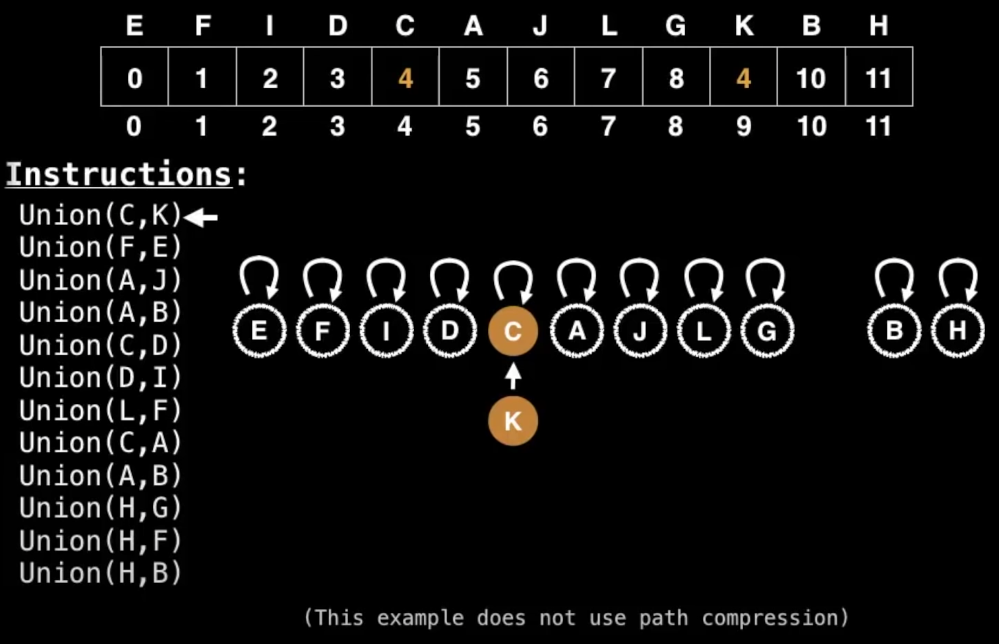
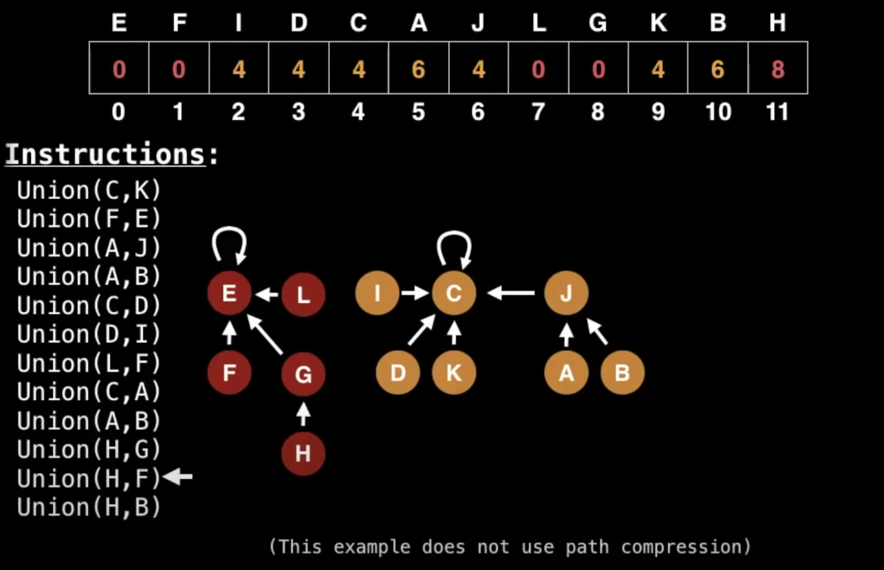

## [YouTube - Data Structures Easy to Advanced Course - Full Tutorial from a Google Engineer](https://youtu.be/RBSGKlAvoiM?t=8907)
Union Find is a data structure that keeps track of elements which are split into one or more disjoint sets. It's primary operations: *find* and *union*
- find: returns the group an element belongs to
- union: joins two groups together

### Uses
- Kruskal's minimum spanning tree algorithm
- Network connectivity

### Complexity Analysis
| Construction | O(n) |
| Union | amortized(n) |
| Find | amortized(n) |
| Get component size | amortized(n) |
| Check if connected | amortized(n) |
| Count components | O(1) |

### Creating Union Find
1. Create a bijection (a mapping) between objects and integers in the range \[0, n)
  - this isn't required but it does allow us construct an array-based union find
  - the mapping of each element to an integer is arbitrary
2. Create an array representing the root of each group
  - at first, each object may point to itself since each object is a root node
  - in this case, based on the bijection in step 1, each element in the array will have a unique integer value
3. As objects are unified into groups, change the values in the array to "point to" the new root node of the group
  - note that when one group is merged into another, only the root nodes value is changed
Note: the algorithm above does not use path compression which is an optimization for union find.

o

Note: It helps to think of the Union Find algorithm in terms of a graph. At first, all elements in the graph may be root nodes. As union operations occur, nodes point to other nodes.
o

### Summary of Algorithm
Find: to find which component a particular element belongs to, find the root of that component by following the parent nodes until a self loop is reached (a node who's parent is itself)
Union: to unify two elements find the root nodes of each componend. If the root nodes are different, make one of the root nodes the parent of the other.

### Path Compression
With path compression, instead of just changing root nodes during a union operation, we perform a compression step.  Let's say in order to find the root node for E we traversed E -> D -> C -> B -> A, during compression we would change the paths to get E -> A, D -> A, C -> A, B -> A. The next time we need to find the root of E, it only takes one operation instead of five.
Essentially with path compression, anytime you walk a path, update all nodes along the path to point to the root node of the path
